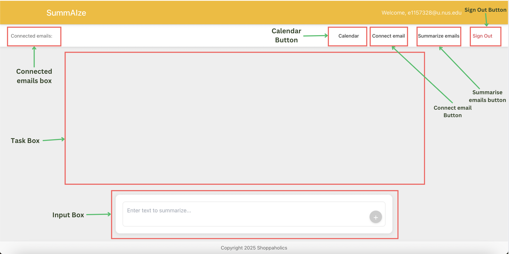
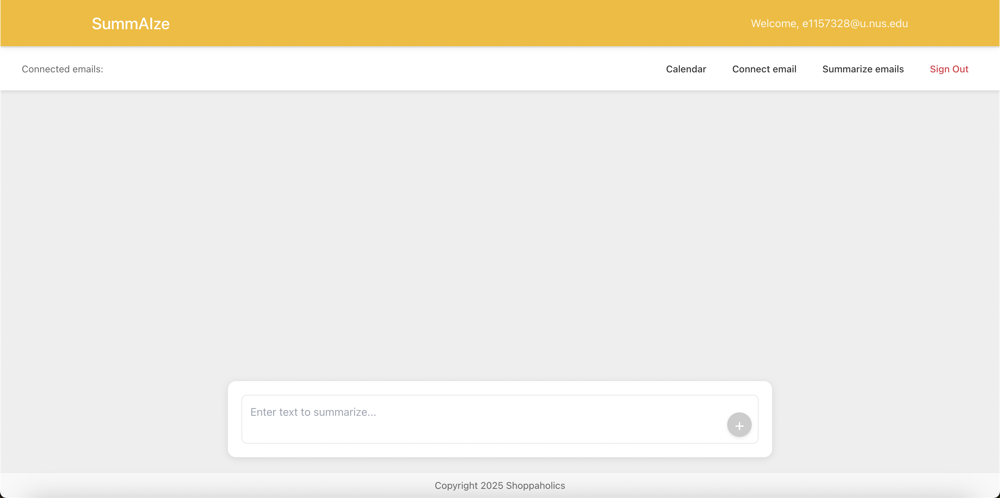
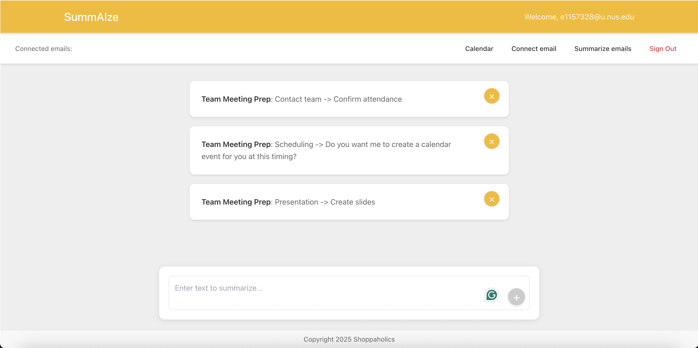
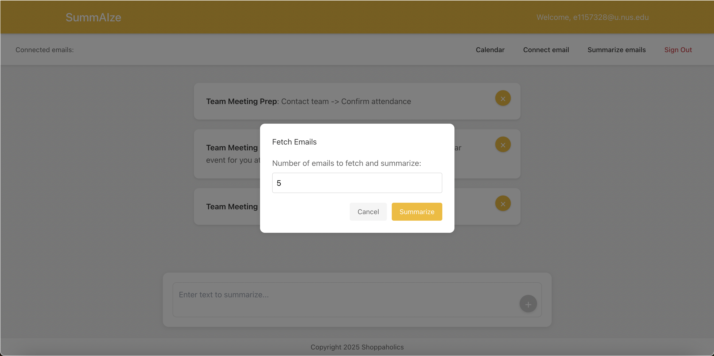
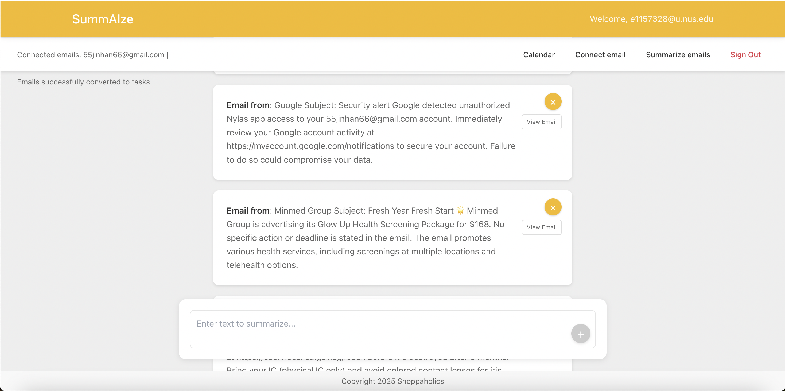
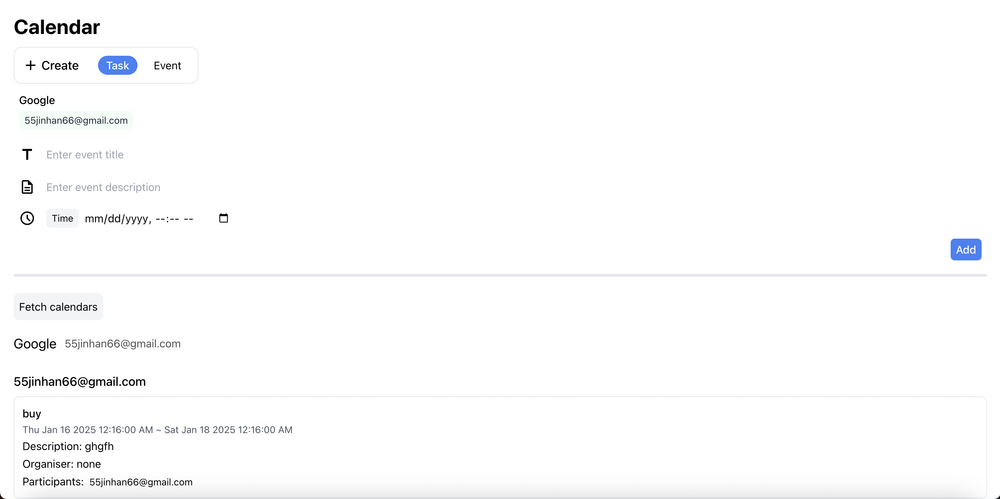

# summAIze

summAIze is a project or Hack For Good Hackathon 2025, designed as a PA system to arrange and schedule meetings, automate tasks, generate summaries of emmails and arrange meetings. It addresses the second problem statement, as a product for Singapore Book Council, with its various fetaures which will be discussed in details below, acting as an efficient PA system for users.

summAize users Google's Gemini AI to summarise emails and automate the generation of tasks. Utilising the free tier of the Gemini API, this makes summAIze a cost effective system for the NPO.

<br>

## Features

- Sign up using email
- Connect email
- Generate tasks from input text
- Delete tasks
- Summarise emails and generate tasks
- Access internal calendar

<br>

## Prerequisites

Before you start, make sure you have the following installed:

- **Node.js**: [Download and install Node.js](https://nodejs.org/)
- **NPM**: Comes with Node.js, used for managing project dependencies.
- **Git**: [Download and install Git](https://git-scm.com/)

<br>

## Environment Setup

1. **Clone the Repository**

   Clone the project repository to your local machine using Git:

   ```bash
   git clone https://github.com/your-username/summAIze.git
   cd summAIze
   ```

2. **Install Dependencies**

   Navigate to the project directory and install the required Node.js packages:

   ```bash
   npm install
   ```

3. **Create an environemnt file**
   Create a `.env` file in the root directory of the project and add the following environment variables:

   ```env
   NYLAS_CLIENT_ID=your_nylas_client_id
   NYLAS_API_KEY=your_nylas_api_key
   NYLAS_API_URI=https://api.us.nylas.com
   REACT_APP_SUPABASE_URL=your_supabase_url
   REACT_APP_SUPABASE_ANON_KEY=your_supabase_anon_key
   REACT_APP_GEMINI_API_KEY=your_gemini_api_key
   ```

      Replace `your_nylas_client_id`, `your_nylas_api_key`, `your_supabase_url`, `your_supabase_anon_key`, and `your_gemini_api_key` with your actual Client ID, API keys and URL.


   You can get these details from the following websites:

   - **Nylas**: Sign up at [Nylas](https://www.nylas.com/) and create a new application to get your `Client ID` and `API Key`.
   - **Supabase**: Sign up at [Supabase](https://supabase.com/dashboard/sign-in?returnTo=%2Fprojects) and go to the API section of your project to obtain your URL and Anon key.
   - **Google Gemini**: Sign up at [Google Cloud](https://cloud.google.com/) to get your API key.

<br>

## Running the project

### 1. **Start the server**
    
   - Navigate to the `summAIze/src/api` directory and run the following command to start the Express server:

   ```
   node server.js
   ```

   - The server will start running on `http://localhost:3001`.

### 2. **Run the project**

   - Enter the following command in a new terminal window:

   ```
   npm start
   ```

   - The project will start running on `http://localhost:3000`.

### 3. **Sign in/Sign up Interface**

When summAIze is first started, you will see an interface like the one below, prompting you to either sign in or sign up. 


<div style="background-color: #d0eaff; border-left: 4px solid #2196F3; padding: 10px; margin-bottom: 10px; border-radius: 5px; color: black;">
📌 <strong>Note:</strong> Information for the signing up and signing in process is given <a href="#1-sign-up-using-email">below</a>.
</div>

### 4. **Introduction to Main Interface**

After logging in, you will see an interface like the one below, made up of multiple components. Here’s a breakdown of each section and its functionality:


* **Connected Emails Box:**  Displays the emails that the user has connected to. (Can display multiple emails)
* **Task Box:** Shows the tasks that the user has.
* **Input Box:** Box for the user to enter text to be summarised and create tasks
* **Calendar Button:** Brings to user to the calendar page.
* **Connect email Button:** Button for the user to connect to their email.
* **Summarise emails button:** Button for users to indicate the number of emails they wish to summarise
* **Sign Out Button:** Button to sign out of the interface.

<br>

## Features 

### 1. Sign up using email

- For first time users, click on the `Sign Up` button and create an account with your email and password.
- A verification email will be sent to your indicated email. Please follow the link to confirm the sign up.
- After signing up, click the `Log In` button to login with your email address.
- After logging in, if everything is correct, the interface will be like the one below, made up of multiple components. 



<div style="background-color: #d0eaff; border-left: 4px solid #2196F3; padding: 10px; margin-bottom: 10px; border-radius: 5px; color: black;">
📌 <strong>Note:</strong> 
Please refer to <a href="#4-introduction-to-main-interface">Introduction to Main Interface</a> for a breakdown of each components and its functionality.
</div>

- To log out, click the `Sign Out` button at the top right of the screen.

<br>

### 2. Connect email

- To connect your email to be used for fetching and summarising your emails, followed by creating relevant tasks, click the `Connect Email` button in the header.
- You will be redirected to Nylas page to login in through your Gmail or Outlook account.
- After logging in through your email account, you will be redirected back to summAIze's Home page.

<br>

### 3. Generate Tasks from Input Text
- Use the **Input Box** to enter text that describes the tasks you want to generate.
- Click on the `+` button, and summAIze will automatically parse the input to create structured tasks.
- These tasks will appear in the **Task Box** with the following details:
   1. Task Name: A concise summary of the task.
   2. Task Description: Steps that need to be taken to complete the task

      <div style="background-color: #d0eaff; border-left: 4px solid #2196F3; padding: 10px; margin-bottom: 10px; border-radius: 5px; color: black;"> 📌 <strong>Note:</strong> For some tasks, the task description will contain `Do you want me to create a calendar event for you at this timing?` or related messages. We plan to integrate a button to automically add the event to the calendar in the future for this type of tasks.
      </div>


- For example:

   1. **Input:** "Prepare presentation for Friday's team meeting."
   2. Generated Tasks are as shown below.
   
      

<br>

### 4. Delete Tasks
- To remove a task, locate it in the **Task Box**.
- Click the `X` button next to the task you want to remove.
- Once the `X` button is clicked, the task will no longer appear in your task list.

<br>

### 5. Summarise emails and generate tasks
- Click the `Summarize emails` button on the main interface.
- Specify the number of recent emails you want to summarise in the popup dialog box shown below. The default number of emails is kept to 5. 

    

- The system will summarise the emails using Google Gemini AI and automatically generate tasks based on the content of the emails. The generated tasks will be displayed in the task box. An example is shown below.

    

- Each summarised email will include:
   1. Email sender
   2. Email subject
   3. A brief summary of the email content.
   4. Any actions to be taken for that specific email.
   5. `View email` button that brings the user to the specific email in their inbox.

<br>

### 6. Access internal calendar

- Click the **Calendar Button** on the main interface to access the internal calendar. This will bring you to the calendar page as shown below.

    

- The calendar allows you to:

   1. View all your tasks in the calendar organised by due date.
   2. Add new tasks or events directly to the calendar.
   3. Sync new tasks that is currently in the calendar from your connected email.

<br>

## Future Enhancements
We are excited about the potential of summAIze and have several features planned to make it even more efficient and user-friendly:

### 1. Integration with Additional Email Providers

While summAIze currently supports Gmail and Outlook, future updates will include support for other major email providers such as Yahoo Mail and ProtonMail. This will enable a broader range of users to connect their preferred email accounts seamlessly.

### 2. Advanced Task Parsing

We plan to improve the AI's ability to process complex or vague input text, providing more detailed and actionable task breakdowns. For example, parsing multi-step instructions or extracting deadlines automatically from input text.

### 3. Automated Task Addition to Calendar

In future iterations, we also plan to automate task addition to calendar, so once a task is created and confirmed by the user, the task will be automically added to the user's calendar.

### 4. Recurring Tasks and Events

Users will soon be able to create recurring tasks or calendar events. This includes options to set daily, weekly, monthly, or custom recurrence intervals, helping users manage repetitive tasks effortlessly.


### 5. Priority Levels for Tasks

Introducing priority tags like High, Medium, and Low for tasks, allowing users to organize and focus on the most critical activities. Sorting tasks by priority in the Task Box and Calendar will also be enabled.
